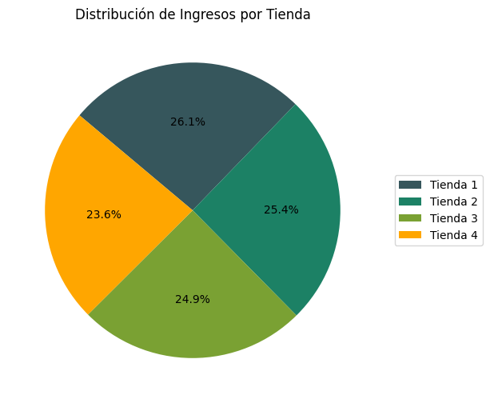
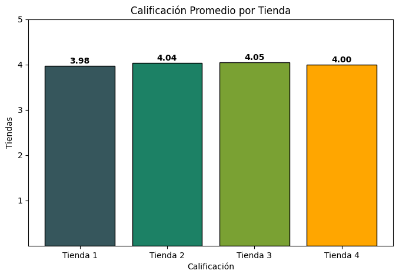

# Challenge Alura Store - Análisis de Ventas


---

## 📋 Tabla de Contenido

- [Descripción](#-descripción)
- [Tecnologías Utilizadas](#-tecnologías-utilizadas)
- [Estructura del Proyecto](#-estructura-del-proyecto)
- [Tareas Realizadas](#-tareas-realizadas)
- [Resultados Obtenidos](#-resultados-obtenidos)
- [Conclusiones](#-conclusiones)
- [Cómo Ejecutar](#-cómo-ejecutar)
- [Autor](#-autor)

---

## 📖 Descripción

Este proyecto forma parte del Challenge de Alura Latam del programa Oracle Next Education (ONE). El objetivo principal es realizar un análisis exhaustivo de los datos de ventas de cuatro tiendas del Sr. Juan para determinar cuál de ellas debería ser vendida basándose en métricas clave de desempeño.

El análisis utiliza técnicas de Data Science para evaluar múltiples aspectos del negocio, incluyendo facturación, satisfacción del cliente, popularidad de productos y costos operativos, proporcionando una recomendación fundamentada en datos.

---

## 🛠️ Tecnologías Utilizadas

- **Python 3.12.12**: Lenguaje de programación principal
- **Pandas**: Manipulación y análisis de datos
- **Matplotlib**: Visualización de datos y generación de gráficos
- **Jupyter Notebook**: Entorno de desarrollo interactivo

### Bibliotecas Específicas

```python
import pandas as pd
import matplotlib.pyplot as plt
```

---

## 📁 Estructura del Proyecto

```
Challenge Alura Store/
│
├── AluraStoreLatam.ipynb          # Notebook principal con el análisis
├── README.md                       # Documentación del proyecto
│
└── imagenes/                       # Visualizaciones generadas
    ├── calificacion.png
    ├── categorias mas vendidas.png
    ├── categorias menos vendidas.png
    ├── costo de envio.png
    └── ingresos.png
```

---

## ✅ Tareas Realizadas

### 0. Preparación de los Datos
- Importación de datos de 4 archivos CSV (una por cada tienda)
- Verificación de valores nulos
- Análisis exploratorio de datos (EDA)
- Validación de tipos de datos y estructura

### 1. Análisis de Facturación
- Cálculo de ingresos totales por tienda
- Visualización de la distribución porcentual de ingresos mediante gráfico de pastel
- Identificación de la tienda con mayor y menor contribución

### 2. Ventas por Categoría
- Análisis de categorías de productos más vendidas por tienda
- Identificación de categorías menos populares
- Comparación entre tiendas mediante gráficos de barras

### 3. Calificación Promedio de la Tienda
- Cálculo de la satisfacción del cliente por tienda
- Visualización comparativa de calificaciones
- Análisis de diferencias entre tiendas

### 4. Productos Más y Menos Vendidos
- Identificación de los 3 productos más vendidos por tienda
- Identificación de los 3 productos menos vendidos por tienda
- Análisis de patrones de venta

### 5. Envío Promedio por Tienda
- Cálculo del costo promedio de envío por tienda
- Visualización comparativa
- Análisis de factores que influyen en el costo

### 6. Informe Final
- Consolidación de hallazgos
- Recomendación basada en datos
- Justificación de la decisión

---

## 📊 Resultados Obtenidos

### Ingresos Totales
- **Tienda 1**: 26.1% (Mayor contribución)
- **Tienda 2**: 25.4%
- **Tienda 3**: 24.9%
- **Tienda 4**: 23.6% (Menor contribución)



### Categorías Más Vendidas
- **Muebles** y **Electrónicos** son las categorías más populares
- La **Tienda 3** lidera en ventas de estas categorías
- La **Tienda 2** presenta menor volumen en categorías populares


### Categorías Menos Vendidas
- Artículos para el hogar
- Libros
- Instrumentos musicales


### Calificación del Cliente
- **Tienda 3**: 4.05 (Mejor calificación)
- **Tienda 2**: 4.04
- **Tienda 4**: 4.00
- **Tienda 1**: 3.98 (Menor calificación)
- Diferencia mínima entre tiendas: 0.07 puntos



### Costo de Envío Promedio
- **Tienda 4**: $23,459.46 (Más bajo)
- **Tienda 3**: $24,805.68
- **Tienda 2**: $25,216.24
- **Tienda 1**: $26,018.61 (Más alto)


### Productos Destacados
El **microondas** aparece como producto más vendido en dos de las cuatro tiendas, mostrando un patrón de demanda consistente.

---

## 🎯 Conclusiones

### Recomendación: Vender la Tienda 4

Después de analizar todas las métricas, se recomienda **vender la Tienda 4** por las siguientes razones:

1. **Menor Contribución a Ingresos**: Representa solo el 23.6% de los ingresos totales, significativamente menor que la Tienda 1 (26.1%)

2. **Desempeño General Mediocre**: Aunque tiene un buen costo de envío, esto puede estar sesgado por el tipo de productos vendidos (incluye libros entre los más vendidos)

3. **Ventaja Marginal en Calificación**: Su calificación (4.00) es solo 0.02 puntos mejor que la Tienda 1, diferencia no significativa en comparación con la brecha de ingresos

4. **Menor Volumen de Ventas**: No destaca en ninguna categoría importante ni en productos de alto valor

### Insights Adicionales

- **Tienda 1** debe ser conservada por su alta contribución a ingresos (26.1%)
- **Tienda 3** muestra el mejor balance: buena calificación (4.05) y alto volumen en categorías rentables
- Las categorías de **Muebles** y **Electrónicos** son clave para el negocio
- Existe oportunidad de mejorar ventas en categorías menos populares

---

## 🚀 Cómo Ejecutar

1. **Clonar el repositorio**:
   ```bash
   git clone https://github.com/IsaiasRVH2/Challenge-Alura-Store.git
   cd Challenge-Alura-Store
   ```

2. **Instalar dependencias**:
   ```bash
   pip install pandas matplotlib jupyter
   ```

3. **Abrir el Notebook**:
   ```bash
   jupyter notebook AluraStoreLatam.ipynb
   ```

4. **Ejecutar las celdas**: Ejecuta todas las celdas secuencialmente para reproducir el análisis

---

## 👤 Autor

**Isaías Ricardo Valdivia**

- GitHub: [@IsaiasRVH2](https://github.com/IsaiasRVH2)
- Proyecto desarrollado como parte del programa **Oracle Next Education (ONE)** - **Alura Latam**

---

## 📝 Licencia

Este proyecto fue desarrollado con fines educativos como parte del Challenge de Alura Latam.

---

⭐ **Challenge completado con éxito** - Oracle Next Education & Alura Latam
